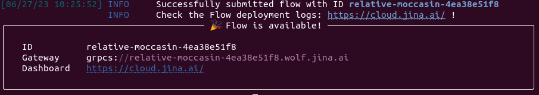
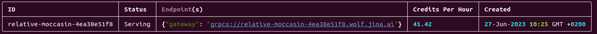
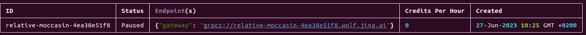

<p align=center>
<a href="https://pypi.org/project/vectordb/"></a>
<!--<a href="https://codecov.io/gh/jina-ai/vectordb"></a>-->
<a href="https://discord.jina.ai"></a>
<a href="https://pypistats.org/packages/vectordb"></a>
<a href="https://github.com/jina-ai/vectordb/actions/workflows/cd.yml"></a>
</p>

# Vector Database for Python Developers

Vector databases store embeddings for semantic similarity between objects, enabling similarity searches across multimodal data types. They enhance LLM applications by providing context and improving generation results.

Meet vectordb: a user-friendly Python solution for creating vector databases with CRUD support. Unlike complex alternatives, vectordb allows easy local deployment while offering scalability features like sharding and replication. Seamlessly transition from a local library to a served database without unnecessary complexity.

vectordb leverages [DocArray](https://github.com/docarray/docarray) retrieval capabilities and [Jina](https://github.com/jina-ai/jina) scalability, reliability, and serving capabilities. In essence, DocArray powers the Vector Search logic while Jina ensures scalable index serving, creating a powerful and user-friendly vector database experience.

<!--In simple terms, one can think as [DocArray](https://github.com/docarray/docarray) being a the `Lucene` algorithmic logic for Vector Search powering the retrieval capabilities and [Jina](https://github.com/jina-ai/jina), the ElasticSearch making sure that the indexes are served and scaled for the clients, `vectordb` wraps these technologies to give a powerful and easy to use experience to
use and develop vector databases.-->

<!--(THIS CAN BE SHOWN WHEN CUSTOMIZATION IS ENABLED) `vectordb` allows you to start simple and work locally while allowing when needed to deploy and scale in a seamless manner. With the help of [DocArray](https://github.com/docarray/docarray) and [Jina](https://github.com/jina-ai/jina) `vectordb` allows developers to focus on the algorithmic part and tweak the core of the vector search with Python as they want while keeping it easy to scale and deploy the solution. -->

<!--(THIS CAN BE SHOWN WHEN CUSTOMIZATION IS ENABLED) Stop wondering what exact algorithms do existing solutions apply, how do they apply filtering or how to map your schema to their solutions, with `vectordb` you as a Python developer can easily understand and control what is the vector search algorithm doing, giving you the full control if needed while supporting you for local setting and in more advanced and demanding scenarios in the cloud. -->  

## :muscle: Features

- User-friendly interface: `vectordb` offers a simple and intuitive interface, catering to users of all levels of expertise.

- Tailored to your needs: `vectordb` provides the necessary features without unnecessary complexity, ensuring a smooth transition from local to server and cloud deployment.

- CRUD support: `vectordb` supports essential CRUD operations, including indexing, searching, updating, and deleting.

- Serve as a service: `vectordb` allows you to serve your databases and perform insertion or searching operations through gRPC, HTTP or Websocket protocols.

- Scalability: Take advantage of `vectordb's` deployment capabilities to benefit from powerful scalability features such as sharding and replication. Sharding improves service latency, while replication enhances availability and throughput.

- DCloud deployment: Easily deploy your service in the cloud using [Jina AI Cloud](https://cloud.jina.ai/). Stay tuned for upcoming deployment options.

- Serverless capacity: `vectordb` can be deployed in the cloud in serverless mode, allowing you to save resources and have the data available only when needed.

- Multiple ANN algorithms: `vectordb` contains different implementations of ANN algorithms. These are the ones offered so far, we plan to integrate more:
   - InMemoryExactNNVectorDB (Exact NN Search): Implements Simple Nearest Neighbour Algorithm.   
   - HNSWVectorDB (based on HNSW): Based on [HNSWLib](https://github.com/nmslib/hnswlib)

<!--(THIS CAN BE SHOWN WHEN FILTER IS ENABLED)- Filter capacity: `vectordb` allows you to have filters on top of the ANN search. -->

<!--(THIS CAN BE SHOWN WHEN FILTER IS ENABLED)- Customizable: `vectordb` can be easily extended to suit your specific needs or schemas, so you can build the database you want and for any input and output schema you want with the help of [DocArray](https://github.com/docarray/docarray).-->

## 🏁 Getting Started

To get started with Vector Database, simply follow these easy steps, in this example we are going to use `InMemoryExactNNVectorDB` as example:

1. Install `vectordb`: 

```pip install vectordb```

2. Define your Index Document schema using [DocArray](https://docs.docarray.org/user_guide/representing/first_step/):

```python
from docarray import DocList, BaseDoc
from docarray.typing import NdArray

class MyTextDoc(BaseDoc):
    text: str = ''
    embedding: NdArray[128]
```

Make sure that the schema has a field `schema` as a `tensor` type with shape annotation as in the example.

3. Use any of the pre-built databases with the document schema (InMemoryExactNNVectorDB or HNSWVectorDB): 

```python
import numpy as np
from vectordb import InMemoryExactNNVectorDB, HNSWVectorDB
db = InMemoryExactNNVectorDB[MyTextDoc](workspace='./workspace_path')

db.index(inputs=DocList[MyTextDoc]([MyTextDoc(text=f'index {i}', embedding=np.random.rand(128)) for i in range(1000)]))
results = db.search(inputs=DocList[MyTextDoc]([MyTextDoc(text='query', embedding=np.random.rand(128))]), limit=10)

for res in results:
    print(f'{res.matches}')
```

Each result will contain the matches under the `.matches` attribute as a `DocList[MyTextDoc]`

4. Serve the database as a service with any of these protocols: `gRPC`, `HTTP` and `Webscoket`.

```python
with InMemoryExactNNVectorDB[MyTextDoc].serve(workspace='./db_path', protocol='grpc', port=12345, replicas=1, shards=1) as service:
   service.index(inputs=DocList[MyTextDoc]([TextDoc(text=f'index {i}', embedding=np.random.rand(128)) for i in range(1000)]))
   service.block()
```

5. Interact with the database through a client in a similar way as previously:

```python
from vectordb import Client

client = Client[MyTextDoc](address='grpc://0.0.0.0:12345')
results = client.search(inputs=DocList[MyTextDoc]([MyTextDoc(text='query', embedding=np.random.rand(128))]), limit=10)
```

## CRUD API:

When using `vectordb` as a library or accesing it from a client to a served instance, the Python objects share the exact same API
to provide `index`, `search`, `update` and `delete` capability:

- `index`: Index gets as input the `DocList` to index.

- `search`: Search gets as input the `DocList` of batched queries or a single `BaseDoc` as single query. It returns a single or multiple results where each query has `matches` and `scores` attributes sorted by `relevance`.

- `delete`: Delete gets as input the `DocList` of documents to delete from the index. The `delete` operation will only care for the `id` attribute, so you need to keep track of the `indexed` `IDs` if you want to delete documents.

- `update`: Delete gets as input the `DocList` of documents to update in the index. The `update` operation will update the `indexed` document with the same Index with the attributes and payload from the input documents.

## :rocket: Serve and scale your own Database, add replication and sharding

### Serving:

In order to enable your `vectordb` served so that it can be accessed from a Client, you can give the following parameters:

- protocol: The protocol to be used for serving, it can be `gRPC`, `HTTP`, `websocket` or any combination of them provided as a list. Defaults to `gRPC`

- port: The port where the service will be accessible, it can be a list of one port for each protocol provided. Default to 8081

- workspace: The workspace is the path used by the VectorDB to hold and persist required data. Defaults to '.' (current directory)


### Scalability

When serving or deploying your Vector Databases you can set 2 scaling parameters and `vectordb`:

- Shards: The number of shards in which the data will be split. This will allow for better latency. `vectordb` will make sure that Documents are indexed in only one of the shards, while search request will be sent to all the shards and `vectordb` will make sure to merge the results from all shards.

- Replicas: The number of replicas of the same DB that must exist. The given replication factor will be shared by all the `shards`. `vectordb` uses [RAFT](https://raft.github.io/) algorithm to ensure that the index is in sync between all the replicas of each shard. With this, `vectordb` increases the availability of the service and allows for better search throughput as multiple replicas can respond in parallel to more search requests while allowing CRUD operations. 

** When deployed to JCloud, the number of replicas will be set to 1. We are working to enable replication in the cloud

## 💻 `vectordb` CLI

`vectordb` is a simple CLI that helps you to serve and deploy your `vectordb` db.

First, you need to embed your database instance or class in a python file.

```python
# example.py
from docarray import DocList, BaseDoc
from docarray.typing import NdArray
from vectordb import InMemoryExactNNVectorDB


class MyDoc(BaseDoc):
    text: str
    embedding: NdArray[128]


db = InMemoryExactNNVectorDB[MyDoc](workspace='./vectordb') # notice how `db` is the instance that we want to serve

if __name__ == '__main__':
    # make sure to protect this part of the code
    with db.serve() as service:
        service.block()
```


| Description | Command | 
| --- | ---: |
| Serve your app locally | `vectordb serve --db example:db` |
| Deploy your app on JCloud |`vectordb deploy --db example:db` |


## :cloud: Deploy it to the cloud

`vectordb` allows you to deploy your solution to the cloud easily. 

1. First, you need to get a [Jina AI Cloud](https://cloud.jina.ai/) account

2. Login to your Jina AI Cloud account using the `jc` command line:

```jc login```

3. Deploy:

```bash
vectordb deploy --db example:db
```



4. Connect from Client

Once deployed, you can use `vectordb` Client to access the given endpoint.

```python
from vectordb import Client

c = Client(address='grpcs://<id>.wolf.jina.ai')
```

5. Manage your deployed instances using [jcloud](https://github.com/jina-ai/jcloud):
You can then list and delete your deployed DBs with `jc` command:

```jcloud list <>```



```jcloud pause <>``` or ```jcloud resume <>```



```jcloud remove <>```
   
## ⚙️ Configure

Here you can find the list of parameters you can use to configure the behavior for each of the `VectorDB` types.

### InMemoryExactNNVectorDB

This database type does an exhaustive search on the embeddings and therefore has a very limited configuration setting:

- workspace: The folder where the required data will be persisted.

```python
InMemoryExactNNVectorDB[MyDoc](workspace='./vectordb')
InMemoryExactNNVectorDB[MyDoc].serve(workspace='./vectordb')
```

### HNSWVectorDB

This database implements Approximate Nearest Neighbour based on HNSW algorithm using [HNSWLib](https://github.com/nmslib/hnswlib).

It containes more configuration options:

- workspace: The folder where the required data will be persisted.
 
Then a set of configurations that tweak the performance and accuracy of the NN search algorithm. You can find more details in [HNSWLib README](https://github.com/nmslib/hnswlib)

- space: name of the space, related to the similarity metric used (can be one of "l2", "ip", or "cosine"), default: "l2"
- max_elements: Initial capacity of the index, which is increased dynamically, default: 1024,
- ef_construction: parameter that controls speed/accuracy trade-off during the index construction, default: 200,
- ef: parameter controlling query time/accuracy trade-off, default: 10,
- M: parameter that defines the maximum number of outgoing connections in the graph, default: 16.
- allow_replace_deleted: enables replacing of deleted elements with new added ones, default: False
- num_threads: default number of threads to use while `index` and `search` are used, default: 1

## 🛣️ Roadmap

We have big plans for the future of Vector Database! Here are some of the features we have in the works:

- More ANN search algorithms: We want to support more ANN search algorithms.
- Filter capacity: We want to support filtering for our offered ANN Search solutions.
- Customizable: We want to make it easy for users to customize the behavior for their specific needs in an easy way for Python developers.
- Serverless capacity: We're working on adding serverless capacity to `vectordb` in the cloud. We currenly allow to scale between 0 and 1 replica, we aim to offer from 0 to N.
- More deploying options: We want to enable deploying `vectordb` on different clouds with more options

If you need any help with `vectordb`, or you are interested on using it and have some requests to make it fit your own need. don't hesitate to reach out to us. You can join our [Slack community](https://jina.ai/slack) and chat with us and other community members.

## Contributing

We welcome contributions from the community! If you have an idea for a new feature or improvement, please let us know. We're always looking for ways to make `vectordb` better for our users.

